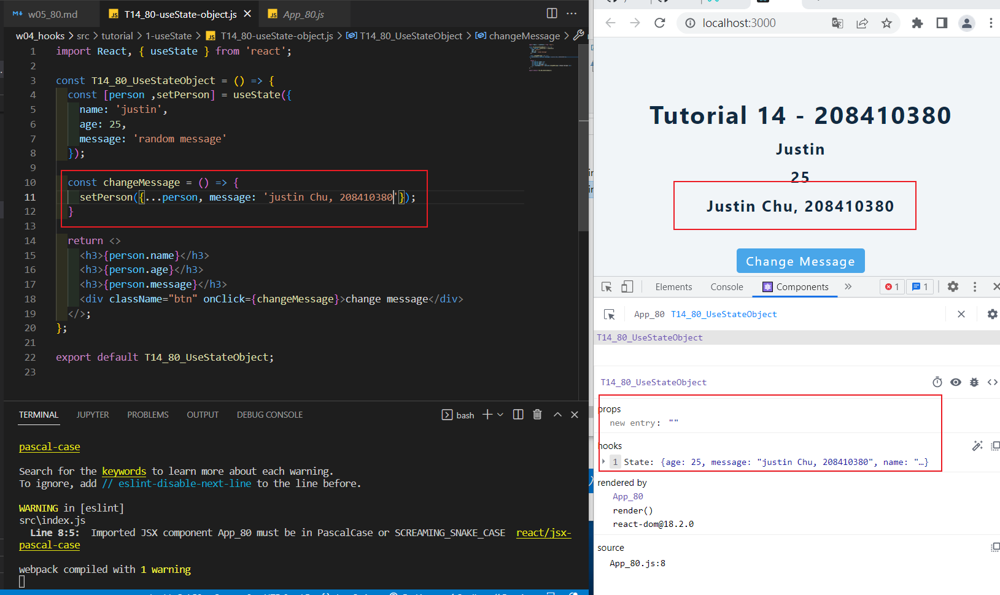
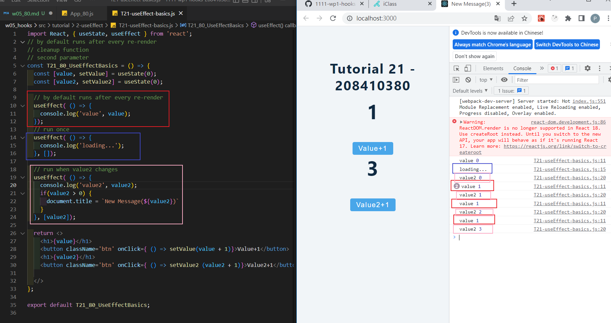
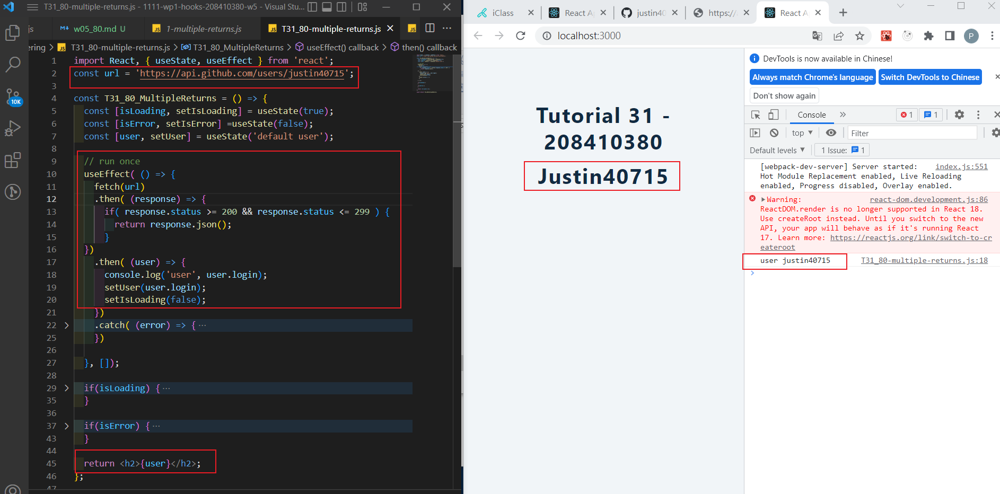
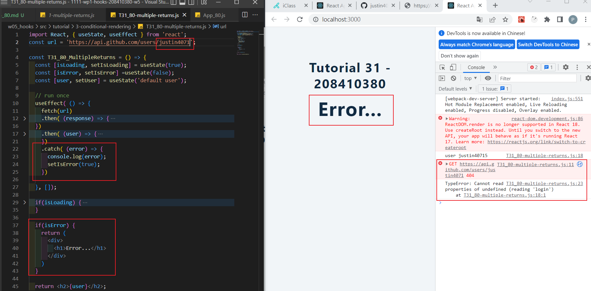
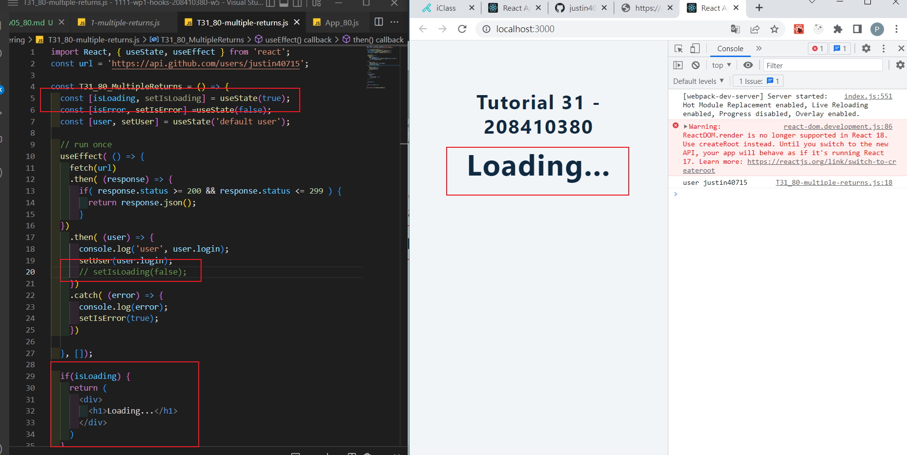
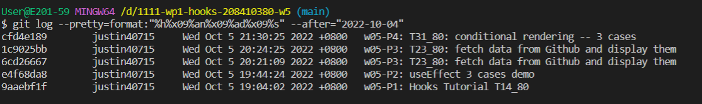

[Github URL] (https://github.com/justin40715/1111-wp1-hooks-208410380-w5)

### w05-P1: Hooks Tutorial T14_80

### w05-P2: T21_80: useEffect 3 cases demo

### w05-P3: T23_80: fetch data from Github and display them

### w05-P4: T31_80: conditional rendering -- 3 cases

### w05-P5: show all four logs

