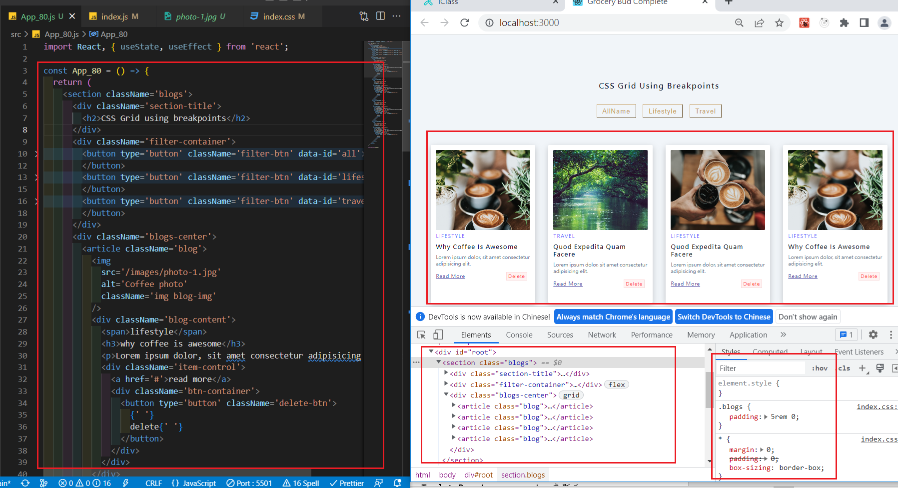
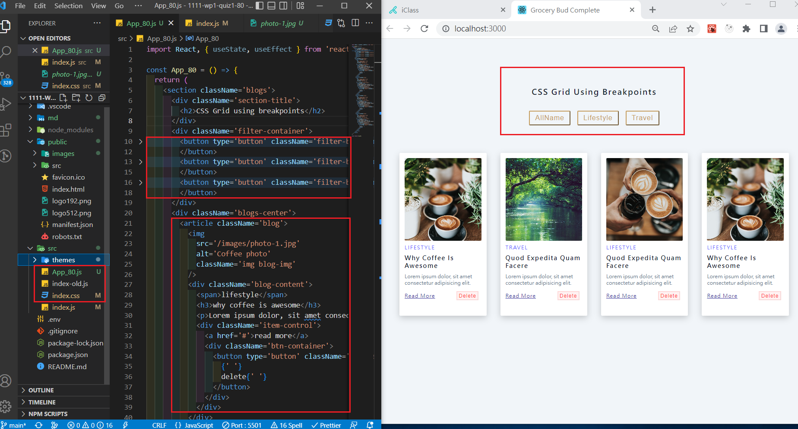
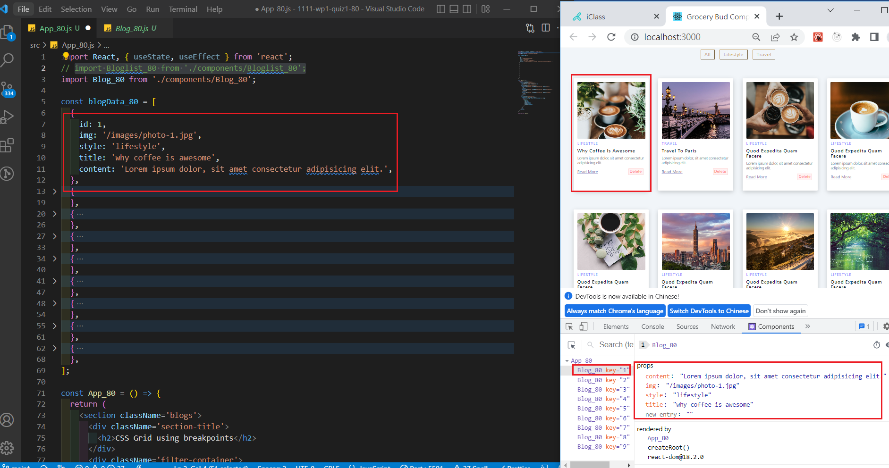
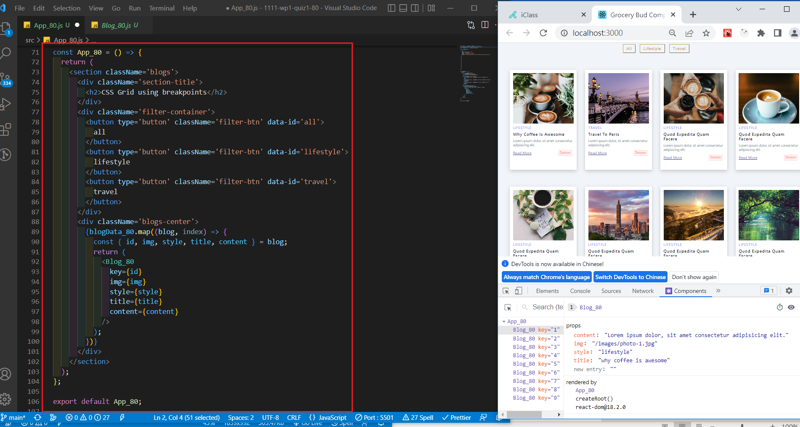

[Github URL] (https://github.com/justin40715/2N-wp1-quiz1_208410380)

### w08-P1: a. 依學號從後往前，顯示對應的四筆 blog，結果圖片請參考 w01-p1.png b.顯示 filter 篩選按鈕，結果圖片請參考 w03-p1.png

### w08-P2: 請將 9 筆 blogs 資訊放入陣列 blogData_xx.js 中，並能套入第 1 題的 App_xx.js 中，要能顯示所有的 blogs，結果圖片請參考 w02-p3.png。

### w08-P3:

### w08-P4:

### w08-P5:

### w08-P6:

### w08-P7:

git log --pretty=format:"%h%x09%an%x09%ad%x09%s" --after="2022-10-11"
